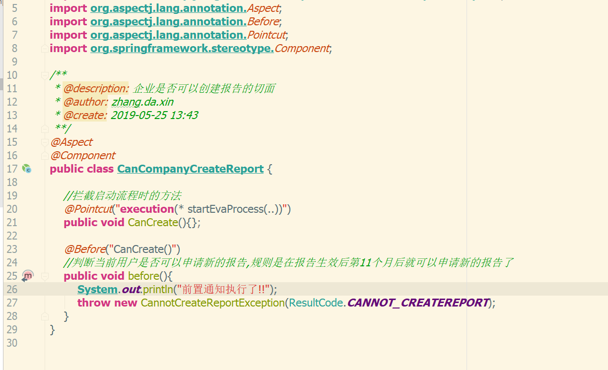
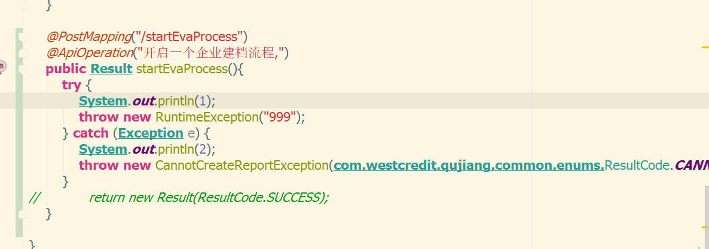
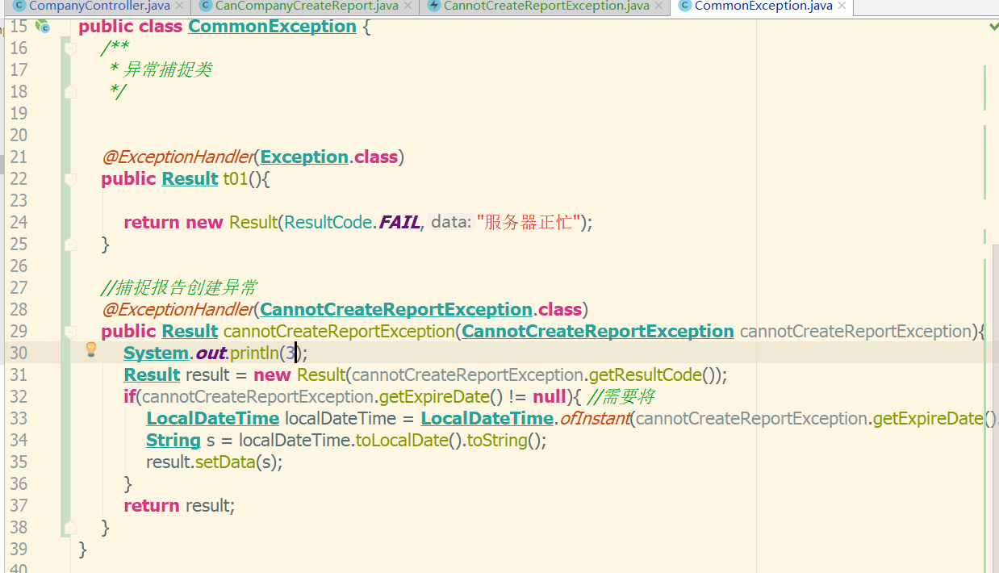
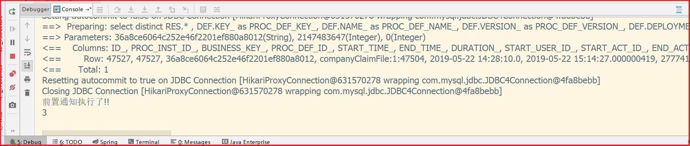

# ControllerAdviceAndAspect
用于测试在SpringBoot中,校验的切面中抛出一个自定义异常,由ControllerAdvice抓住并处理异常的问题。

## 执行顺序问题

根据此时,如果在切面中抛出一个异常后,controller以及以后的代码都是不会执行的。ControllerAdvice会直接抓住异常并进行自定义异常处理逻辑。

在加入切面的Controller类中,执行顺序是这样的,首先执行切面的前置通知,然后方法的调用转到Controller类中,无论哪一步抛出异常,都会导致之后的代码不会执行。

切面类

Controller类

ControllerAdvice类

执行结果(此时在切面中直接抛出异常了)

## 一些注意点

在我们构造异常的时候,传递枚举类的作用只是为了方便数据的聚合,具体的实现可以看业务逻辑"随意编写"!

